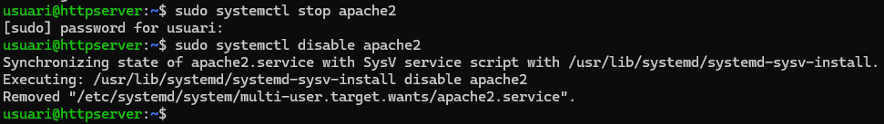
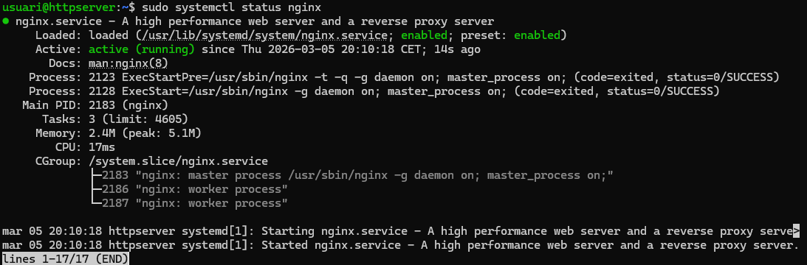
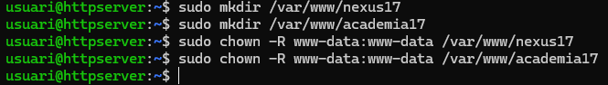
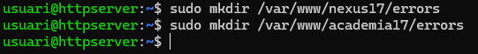
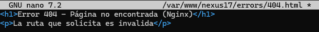
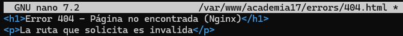
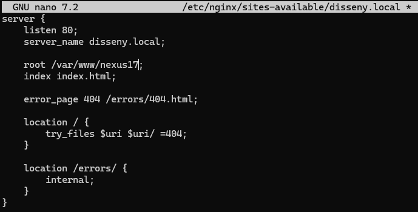
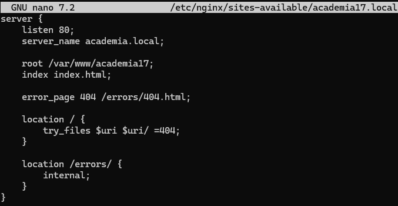
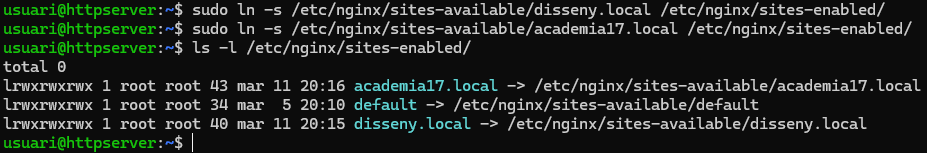
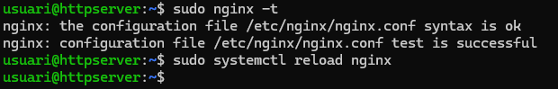

# Guia Tècnica

## Migració i Implementació d’Infraestructura Web amb Nginx

Projecte Nexus – Missió T03: Arquitectura Lleugera i Alt Rendiment

***

## 1. Introducció

El projecte té com a objectiu migrar la infraestructura web prèviament implementada amb Apache cap a Nginx, un servidor lleuger i eficient capaç de gestionar un gran volum de connexions concurrents gràcies a la seva arquitectura orientada a esdeveniments.

Aquesta migració permet:

*   Augmentar el rendiment.
*   Millorar l’escalabilitat del sistema.
*   Disposar d’una alternativa d’altes prestacions.
*   Comparar l’arquitectura Apache vs Nginx en entorns reals.

Durant aquesta activitat es configuraran:

*   Dos dominis independents (Server Blocks).
*   Estructura de carpetes amb permisos adequats.
*   Pàgines d’error personalitzades.
*   HTTPS mitjançant certificats SSL.
*   Redirecció automàtica 80→443.
*   Optimització habilitant HTTP/2.

***

## 2. Preparació de l’Entorn i Instal·lació de Nginx

### 2.1. Aturar i deshabilitar Apache2

Per evitar conflictes als ports 80 i 443:

    sudo systemctl stop apache2
    sudo systemctl disable apache2

**Captura:** Estat d’aturada i deshabilitació d’Apache  

***

### 2.2. Instal·lació del servidor web Nginx

    sudo apt update
    sudo apt install nginx -y

***

### 2.3. Verificació del servei Nginx

    sudo systemctl status nginx

El servei ha d’aparèixer com **active (running)**.

**Captura:** Estat del servei Nginx  

***

### 2.4. Prova de funcionament al navegador

Accedir a:

    http://IP-del-servidor

Ha d’aparèixer la pàgina de benvinguda **Welcome to Nginx!**

**Captura:** Pàgina de benvinguda  

***

## 3. Configuració de l’Estructura de Directoris

Es creen dues carpetes separades per als dos dominis:

    sudo mkdir /var/www/nexus17
    sudo mkdir /var/www/academia17
    sudo mkdir /var/www/nexus17/errors
    sudo mkdir /var/www/academia17/errors

Assignació de permisos i propietari www-data:

    sudo chown -R www-data:www-data /var/www/nexus17
    sudo chown -R www-data:www-data /var/www/academia17

**Captura:** Execució dels comandos  

***

## 4. Creació de Pàgines d’Error Personalitzades

Exemple (404.html):

    <h1>Error 404 – Página no encontrada (Nginx)</h1>
    
La ruta que solicita es inválida

Ubicacions:

*   /var/www/nexus17/errors/404.html
*   /var/www/academia17/errors/404.html

**Captures:**  

***

## 5. Configuració dels Server Blocks (Multidomini)

Es creen dos fitxers:

### 5.1. Server Block per disseny.local

Fitxer: /etc/nginx/sites-available/disseny.local

    server {
        listen 80;
        server_name disseny.local;

        root /var/www/nexus17;
        index index.html;

        error_page 404 /errors/404.html;

        location / {
            try_files $uri $uri/ =404;
        }

        location /errors/ {
            internal;
        }
    }

***

### 5.2. Server Block per academia17.local

Fitxer: /etc/nginx/sites-available/academia17.local

    server {
        listen 80;
        server_name academia.local;

        root /var/www/academia17;
        index index.html;

        error_page 404 /errors/404.html;

        location / {
            try_files $uri $uri/ =404;
        }

        location /errors/ {
            internal;
        }
    }

***

### 5.3. Activació dels Server Blocks

    sudo ln -s /etc/nginx/sites-available/disseny.local /etc/nginx/sites-enabled/
    sudo ln -s /etc/nginx/sites-available/academia17.local /etc/nginx/sites-enabled/

**Captura:** Llistat de sites-enabled  

***

### 5.4. Comprovació de sintaxi i recàrrega

    sudo nginx -t
    sudo systemctl reload nginx

**Captura:** nginx -t OK  

***

## 6. Configuració HTTPS (SSL/TLS)

### 6.1. Creació o ús dels certificats SSL

Generació d’un certificat autosignat:

    sudo openssl req -x509 -nodes -days 365 \
    -newkey rsa:2048 \
    -keyout /etc/ssl/private/disseny.key \
    -out /etc/ssl/certs/disseny.crt

Es repeteix per academia17 si es volen certificats separats.

***

### 6.2. Server Block HTTPS

    server {
        listen 443 ssl http2;
        server_name disseny.local;

        root /var/www/nexus17;
        index index.html;

        ssl_certificate /etc/ssl/certs/disseny.crt;
        ssl_certificate_key /etc/ssl/private/disseny.key;

        error_page 404 /errors/404.html;

        location / {
            try_files $uri $uri/ =404;
        }

        location /errors/ {
            internal;
        }
    }

Idèntic per academia, canviant rutes i server\_name.

***

## 7. Redirecció Automàtica HTTP→HTTPS

    server {
        listen 80;
        server_name disseny.local;
        return 301 https://$host$request_uri;
    }

I l’equivalent per academia.local.

***

## 8. Verificacions Finals

### 8.1. Redirecció 80→443

Accedir a:  
<http://disseny.local>  
Redirigeix a:  
<https://disseny.local>

### 8.2. Certificat SSL funcional

El navegador indica connexió segura (encara que sigui autosignada).

### 8.3. HTTP/2 actiu

Inspect → Network → columna Protocol → mostra h2.

### 8.4. Pàgina 404 personalitzada també en HTTPS

<https://disseny.local/noexiste>

**Captures:**  
\[INSERIR CAPTURA HTTPS]  
\[INSERIR CAPTURA HTTP2]  
\[INSERIR CAPTURA 404 HTTPS]

***

